# SmallApp · Vue3 中后台权限管理系统（纯前端演示版）

> 开箱即用的 Vue3 + Element Plus 管理后台，内置 **RBAC 权限、多角色、验证码登录、动态菜单、标签页**。零后端、零数据库、零 Redis，clone 即跑，已部署在线可体验。

       

在线阅读/Demo：<https://airer-tian.github.io/smallApp-demo/>

---

**进入系统可直接体验**｜演示账号：`admin` / `123456`

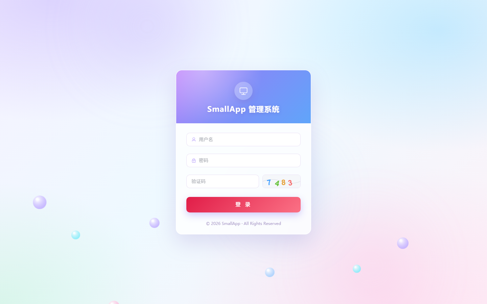

## ✨ 核心亮点

- 🔐 **多角色权限（RBAC）**：超级管理员 / 普通用户 / 审计员，不同角色看到不同菜单
- 🎛️ **按钮级权限**：页面内操作按钮按权限显隐
- 🖥️ **验证码登录**：SVG 图形验证码（纯前端生成与校验）
- 🧭 **动态菜单 + 标签页**：按角色动态注册路由、可拖拽/关闭的页签
- 🧩 **完整业务模块**：用户 / 角色 / 菜单 / 部门 / 字典 / 操作日志 / 登录日志 / 个人中心
- ⚡ **零依赖部署**：数据存 `localStorage`，无服务端，静态托管即可上线
- ✅ **含单元测试**：Vitest，10 个用例全过

## ✨ 界面预览

**首页工作台**

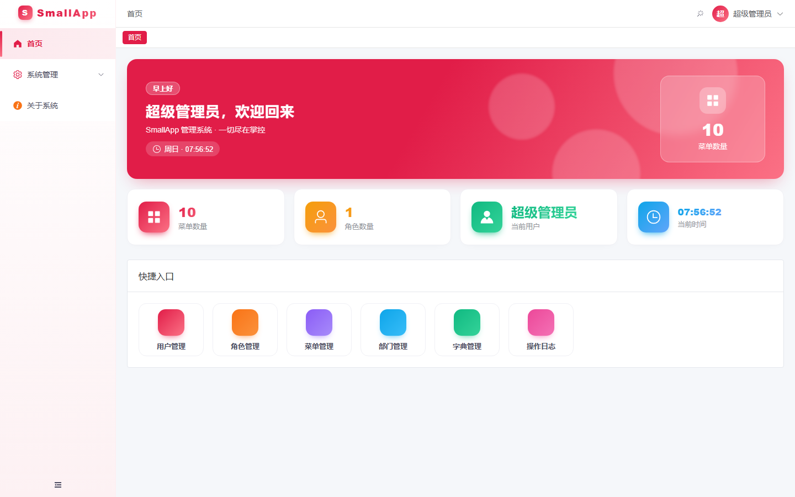

**系统管理各列表页**

| 用户管理 | 角色管理 |
| --- | --- |
| 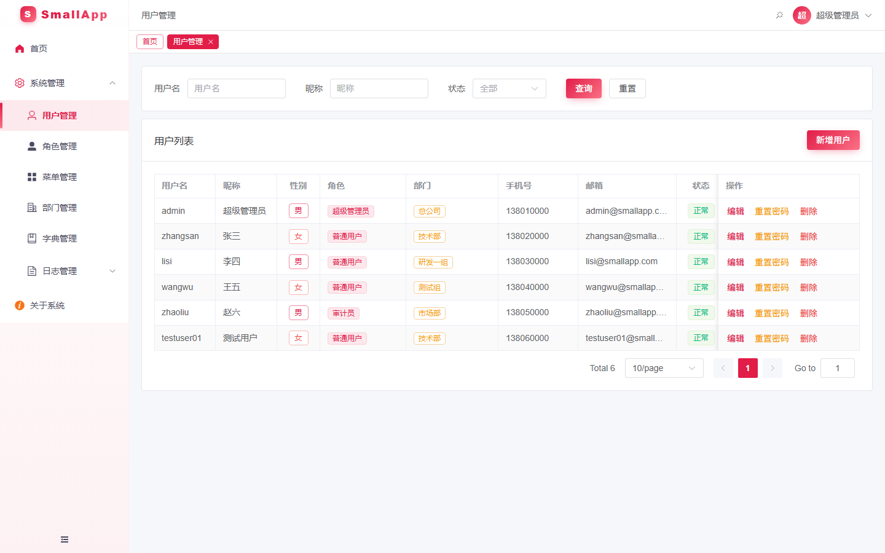 | 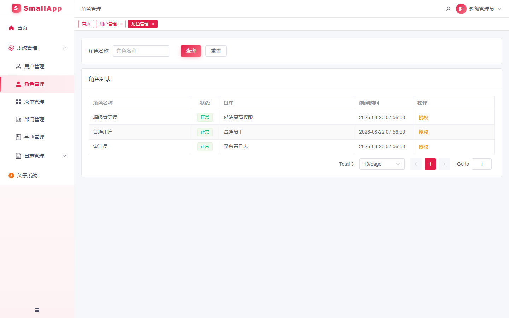 |

| 菜单管理 | 部门管理 |
| --- | --- |
| 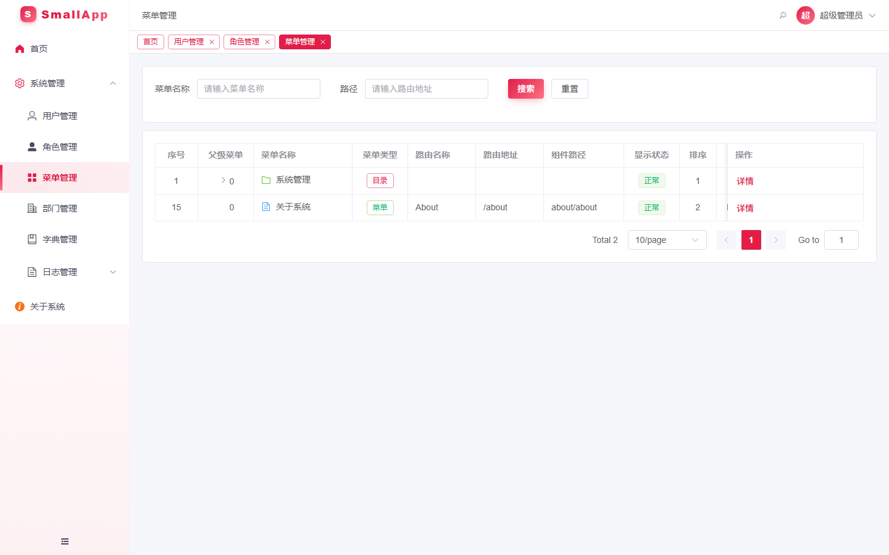 | 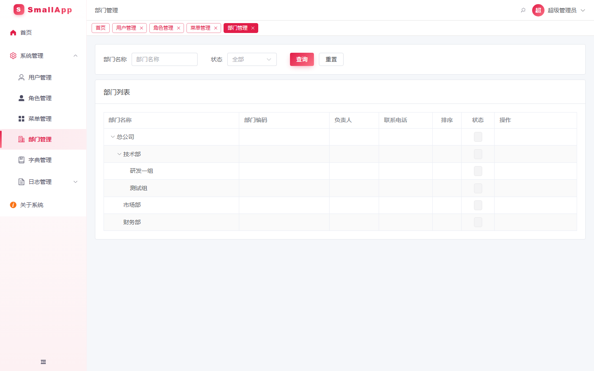 |

| 字典管理 | 操作日志 |
| --- | --- |
| 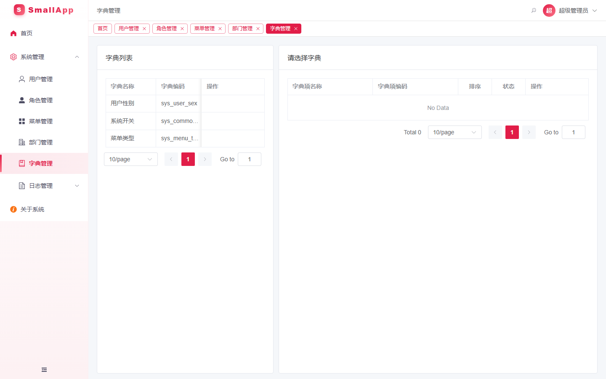 | 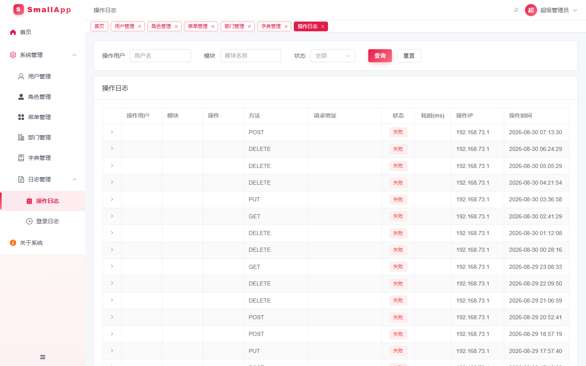 |

| 登录日志 | 个人中心 |
| --- | --- |
| 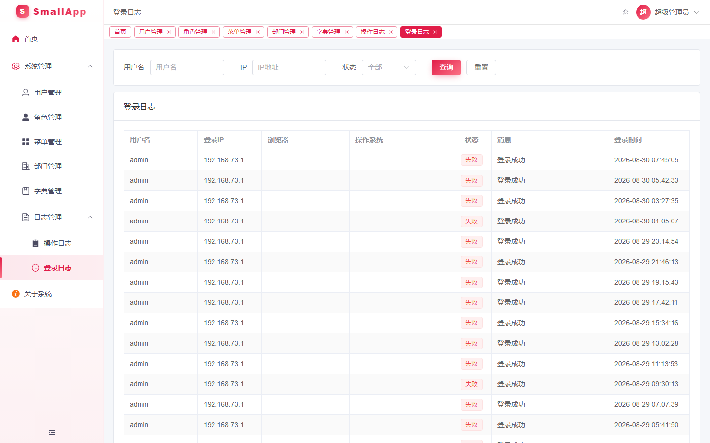 | 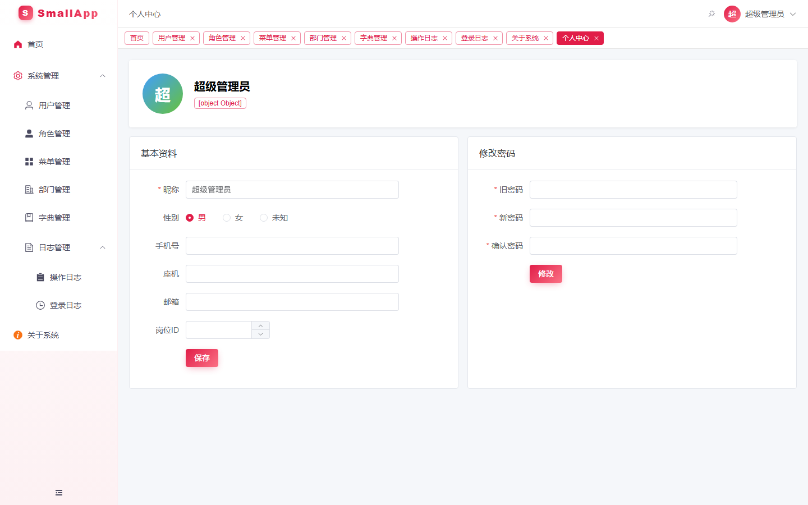 |

**关于系统**

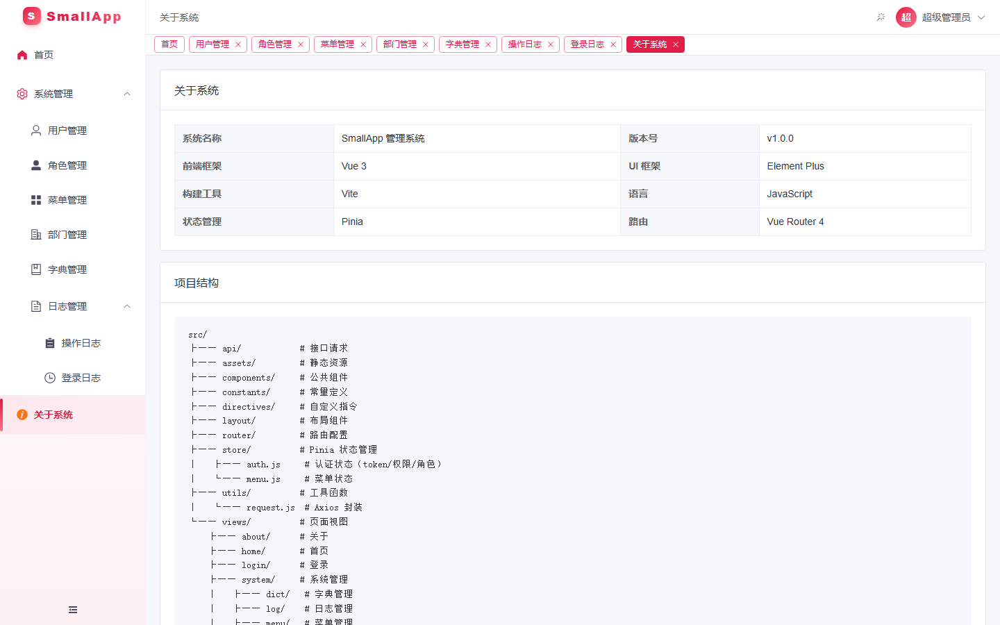

## 🚀 快速开始

```bash
npm install
npm run dev      # 开发预览 http://localhost:5173
npm run build    # 产出 dist/ 静态资源
```

### 默认账号

| 用户名 | 密码 | 角色 |
| --- | --- | --- |
| `admin` | `123456` | 超级管理员（全部菜单与按钮权限） |
| `zhangsan` | `123456` | 普通用户 |
| `zhaoliu` | `123456` | 审计员（仅首页 + 日志） |

> 演示版统一口令为 `123456`，仅用于体验；真实部署请使用后端版本并启用强密码策略。

## 🧰 技术栈

- **框架**：Vue 3 + Vite 6 + Vue Router 4
- **UI**：Element Plus 2.9
- **状态管理**：Pinia 3（持久化）
- **请求**：Axios 1.9
- **测试**：Vitest 3
- **Mock**：内置前端伪后端（`src/mock/`）

## 🛠 部署为静态站点

构建产物在 `dist/`，任意静态托管直接托管该目录即可（使用 hash 路由，无需服务端 rewrite）。

- **GitHub Pages**：将 `dist/` 推到仓库并用 Pages 部署。
- **Render**：新建 Static Site，Build Command 填 `npm install && npm run build`，Publish 目录填 `dist`。
- **Vercel / Netlify**：框架选 Vite，输出目录 `dist`。

环境变量（默认即开启 mock，一般无需修改）：

- `VITE_USE_MOCK=true`：走前端伪后端（默认）。设为 `false` 可切回真实后端（需自行配置 `VITE_API_BASE`）。

## 数据重置

清空浏览器 `localStorage` 中键 `smallapp_demo_v2` 即可恢复初始种子数据。

## 与后端版的区别

- 无登录验证码 Redis 依赖：验证码在前端生成与校验（仅供演示）。
- 不校验密码强度，统一 `123456`。
- 所有增删改查写入 `localStorage`，仅当前浏览器可见。

源码位于 `src/mock/`：`data.js`（种子 + 持久化）、`server.js`（接口路由）。

## 许可证

- 本项目（含演示版）源码以 **Apache-2.0** 发布，详见仓库根目录 `LICENSE`。
- 演示版仅依赖 Vue、Element Plus、axios、Vite 等 **MIT / ISC / BSD / Apache-2.0** 组件，
  无任何 GPL / AGPL / LGPL 等 copyleft 依赖；第三方许可证详见根目录 `THIRD-PARTY-NOTICES.md`。
- 演示版不含后端、数据库驱动或任何 TLS/代码签名证书，部署时的 HTTPS 由托管平台提供。
